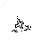

# Alphanumeric Classification

We have alphanumeric classification using two methods.
First, we trained an Inception-V3 model with 26 classes - One for each letter.
Unlike the training data for shapes, each alphanumeric was trained with upright images.
Part of the competition is to find the orientation of the text, so we needed to train our model in a way that it would only recognize the alpha once it was rotated in the correct direction.
We had problems with this approach because it required a large number of classes with several thousand training images each.
It was also too easy to get false positives if we ran the image through our model at every orientation, and it was very computationally taxing.

To try and fix these problems, we switched to pytesseract for our classification needs.
Pytesseract is the python version of the deep learning based text recognition software.
It takes in black text on a white background and outputs the character or string it thinks it's found.
We need to take several steps to get our image in this format.
_Note: This is only possible if our shape is a smooth, closed contour._

We will start with the cropped image of our shape.
```python
# Run edge detection on cropped image w/ low thresholds
alpha_edges = cv2.Canny(shape_img, 50, 200)
# Isolate contours
_, alpha_thresh = cv2.threshold(alpha_edges, 127, 255, 0)
_, alpha_contours, _ = cv2.findContours(alpha_thresh, cv2.RETR_EXTERNAL, cv2.CHAIN_APPROX_SIMPLE)
# We take the longest discovered contour as the contour of the overall shape.
shape_cnt = alpha_contours[len(alpha_contours)-1]
# Create a mask around the image
alpha_mask = np.zeros(shape_img.shape[:2], dtype='uint8')
for alpha_cnt in alpha_contours:
	# Here we draw every contour greater than 5 pixels long on the image we have.
    if len(alpha_cnt) > 5:
		cv2.drawContours(alpha_mask, [alpha_cnt], -1, 255, -1)
	alphaedges = cv2.bitwise_and(alpha_edges, alpha_edges, mask=alpha_mask)
# Create the final image
alpha_kernel = np.ones((1, 1), np.uint8)
alphaedges = cv2.dilate(alphaedges, alpha_kernel, 1)
alphaedges = cv2.erode(alphaedges, alpha_kernel, 1)
alphaedges = cv2.bitwise_not(alphaedges)
alphaedges = cv2.drawContours(alphaedges, [shape_cnt], -1, (250, 250, 250), 5)
```

Unfortunately, this leaves us with very noisy images which pytesseract cannot identify.
On top of that, there is no way to find the orientation of the alphanumeric.


