# Generating Training Data

Generating training data is the most tedious yet necessary steps of image recognition.
To begin, you need a folder for your training data containing one empty folder per shape you would like to classify.

You will then need to make a separate folder and fill it with base shapes - 
Or you can just download the one we have available on [github](add this link when ready).

If you have decided to make your own shapes, make sure they are plain shapes on a white background, just like they are in our example.
You should also try to have at LEAST one unique base shape per thousand training shapes you plan to generate.
I would recommend a minimum of ~5,000 images per class.
We already have a shapeGen.py script available on github which randomizes color, size, orientation, and bluriness in each shape and saves it to your training data folder.

Here are example images from previous competitions and flight tests - 
This is what we are attempting to replicate.

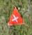
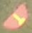
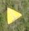
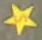
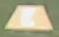
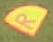

And here are some outputs from our script: 

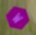
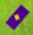
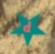
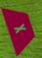

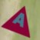

One issue we've run into has been false positives from interesing features on the runway.
Here are examples of things that will get identified as a shape without actually being a competition target:

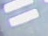
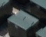
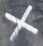
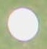
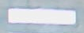

These are all clearly real shapes, but they are not targets.
To fix this issue, we added a Not a Shape (NaS) class as a catch-all for items around the field.
We have a separate scripy, nasGen.py, which will take old flight test images and write every single blob to a file.
Unfortunately, you will have to go through this folder and manually remove all the actual targets manually so they won't be part of the training data.
