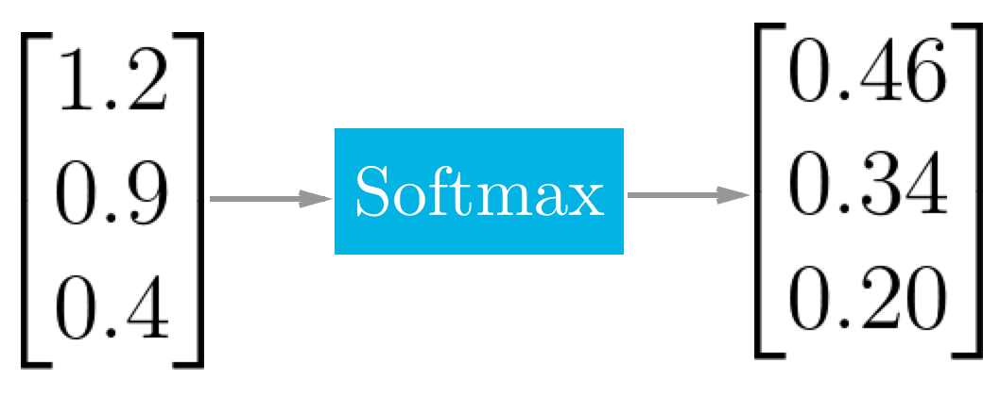

# Hidden Layers

## Convolutional Layer
The first type of hidden layer we will discuss is the convolutional layer.
It takes as input an image and a kernel size.
The image will be in the format of a 3D array - For this example let's say its size is 32 x 32 x 3.
The kernel size specifies the length of the area each pixel will be compared to.
For this example let's say it's 5 for an area of 25 square pixels.

This layer will compare these 25 pixels to our initial image and give it a score based on how similarly it matches the original image.
Once it has given a value, it will move one pixel over and repeat the process.
The output of a the convolutional layer for a 32 x 32 x 3 image will be a 28 x 28 x 1 array.

Let's take a look at an example of an image of a mouse. 

In this example, the kernel size is 7.
If we zoom in on the highlighted curve, we will get 7x7 array that we can compare with the CNN's idea of what a curve is.

This area fits very will with what the neural network has decided is a curve and can therefore simplify this entire area as 6600.
If we try the same thing with a different part of the mouse, we will get a much lower value.

This section will now be simplified to the number 0.
By the end of this layer, we will have an output array of all the curves of the image.
This process will be repeated for different features, and we will be left with a description of the features of the image rather than an array of pixels.
If you want your CNN to be faster, you can sacrifice some of the accuracy by increasing the stride -
That is, by increasing the number of pixels your window moves with each step.

## Rectified Linear Units (ReLU) Layer
The ReLU layer applies the function \\(f(x) = max(0,x)\\). 
This gets rid of anything below zero because it will not be relevant in our final prediction.
This is similar to the sign function we applied to our perceptron in the previous section.

## Pooling Layer
The pooling layer is an optional layer that takes as input a filter and a stride of the same length.
It then looks in each region for the maximum value and downsizes your array.
The output is a less descriptive but also less computationally taxing description of our original image.

## Fully Connected Layer
This final step connects all neurons, just like a regular neural network.
It is the hidden layer where classification actually takes place.
See the section on intro to neural nets for information on how they work.

## Softmax Layer
This "layer" is less of a layer and more of a scaling function.
It takes the outputs from the fully connected layer and scales them relative to each other in a way that they all add up to 1.
This takes our outputs from the previous layer and converts them into probabilities,
which will be used as weights in the following layer.

