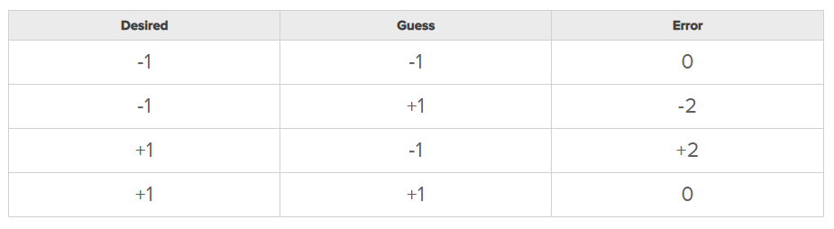

# Intro to Neural Nets

A neural network is a computing system modeled after biological neural networks.
It consists of inputs, connections, and a predefined number of outputs.

A perceptron is the simplest neural net you can build.  
During this section of the lecture, we will be following along and making our own perceptron in Python.  
Make sure you download the exercise file from Box before we start.  
It consists of one processor, two inputs, and an output.

Each input in this example has both a value and an assigned weight.
To compute the output of a perceptron, multiply each value by its weight.

### Exercise:  
What is the output of the following perceptron?

Input 0: 3  
Input 1: 11  

Weight 0: 0.8  
Weight 1: -0.1  

Solution

Input 0 * Weight 0 + Input 1 * Weight 1 = 
3 * 0.8 + 11 * (-0.1)

Answer = 1.3

Now let's try to build a perceptron that can guess on which side of a line a point lies. 
Obviously, we don't need a neural network to do this, but it is a good practice example. 

The first step is to send our output through an activation function. 
We don't really care what the output is, we only care whether or not it's above zero. 
This means we can use a sign activation function to simplify our outputs to either +1 or -1. 

Now, take the case of (x,y) = (0,0). 
No weight we could possibly assign it would make our output anything other than zero. 
To combat this, most neural networks have an added bias - 
An additional value with a small weight to it. In our example, the bias will be 1.  
We should have all our variables now, so go ahead and choose three random numbers between 1 and -1 and assign them as your weights. 

Now it's time to calculate the error with our current weights. 
Error is calculated by subtracting the guess from the actual input. 
Here is an example:

We will adjust our weight using the following formulas: 
 
\\(New Weight = Weight + ∆Weight\\)  
\\(∆Weight = Error * Input\\)

Go ahead and run the code you have so far.
Why doesn't it work?

Take a look at our weights.
We want their values to roughly stay within -1 and 1.
If we calculate the delta weights at each step, 
they are well above 1 and will increase our weights much faster than we would like.
This is called "overshooting", and it means we need to add a learning rate to slow down the increase or decrease of the weights.

Since we are using 1,000 data points to train our model, 
let's set our learning rate to 1/10002.
Our new set of equations should look like this:

\\(New Weight = Weight + ∆Weight\\)  
\\(∆Weight = Error * Input * Learning Rate\\)

Now you have a simple neural net!
Each layer of an artificial neural network will consist of many rows of what we've just built,
and a deep neural net will have multiple layers.