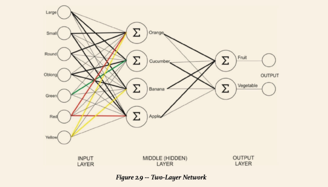

# Intro to Neural Nets

A neural network is a computing system modeled after biological neural networks.
It consists of inputs, connections, and a predefined number of outputs.

As you train your neural network, each connection will be assigned a weight based on its importance in identifying the output correctly.
Take this fruit predicting neural network for example:

The connections (hidden layers) extract features from the overall image.
This is where the computer would recognize that an image has properties such as yellow, curved, and long.
Once the individual features are extracted, the computer goes on to the classification portion.

_Working on section about weights and biases_