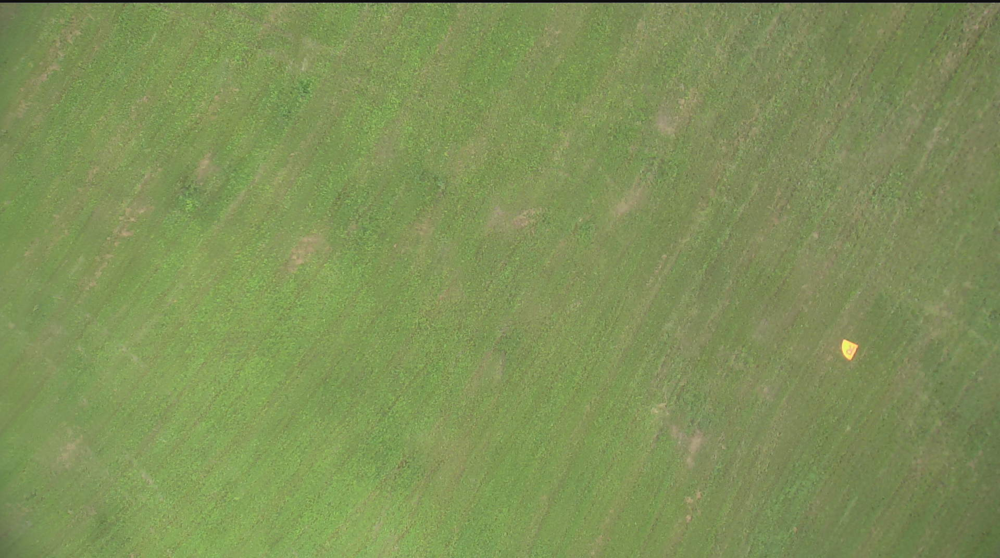
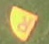
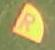
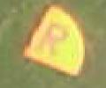

# Basic Image Manipulation

## Geometric Transformations  
OpenCV and PIL have predefined functions for the main three geometric translations we will use for preprocessing:
Cropping, Rotation, and Scaling.
You can use either CV2 or PIL for all of these transformations, but we will mainly be using PIL.
Take the following image for example:  



We want to crop this photo to the quarter circle in the lower right.
The first step will be loading the image in your Python script.  

```python
from PIL import Image
img = Image.open("//path//to//comp_photo.jpg")
# Sanity Check
img.show('Example Image')
```
	
Now, we need to pick the location to crop our image to.
We want a cropped photo with a width of 60 pixels and a height of 50 pixels.
PIL uses an (x,y) coordinate system where the upper left corner is (0,0) and the lower right corner is the full (width,height) of the image.
The syntax for cropping an image with PIL is this:  
```python
img = img.crop((x, y, x+w, y+h))
```

The quarter circle is located 1605 pixels to the right of the left edge of the image and 645 pixels down from the top edge.
On your own, pick the appropriate x, y, w(idth), and h(eight) values and display the image.
It should look like this:



<details><summary>Solution</summary>
<p>

```python
img = img.crop((1605,645,1660,695))
img.show('Cropped Image')
```

</p>
</details>

Now that we have our fully cropped image, let's use the PIL command rotate() to rotate it so the R in the center is more or less upright. 



```python
img = img.rotate(angle)
# PIL command to show an image
img.show("Rotated Image")
```

<details><summary>Solution</summary>
<p>

```python
img = img.rotate(180)
img.show("Rotated Image")
```

</p>
</details>

Let's make this image a little easier to see.
The function img.resize() takes in a tuple of (width, height) to resize an image to.
You can use this to squish or stretch an image, but in this case let's use it to double the size of our newly rotated image. 
_Hint: Don't forget, the input is a tuple._



<details><summary>Solution</summary>
<p>

```python
img = img.resize((120, 100))
```

</p>
</details>

