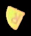

# Masking Images

In order to accurately predict the color of a shape, we need to find a way to get rid of the background colors.
One option is to tightly crop the image, but that will still leave in some of the background and will drop a lot of the color at the edges of the shape.
However if we have a nice, closed contour we will be able to replace everything outside of that contour with a black mask, like so:  



```python
padding=20
mask = np.zeros(img.shape[:2], dtype='uint8')
cv2.drawContours(mask, [cnt], -1, 255, -1)
img = cv2.bitwise_and(img, img, mask=mask)
img = img[(y - int(padding / 2)):(y + h + int(padding / 2)),
              (x - int(padding / 2)):(x + w + int(padding / 2))]
```

You have to be careful with masking images.
It does not check if a contour is connected before applying the mask, 
so your script may try to apply a mask to a single contour and result in a black image.