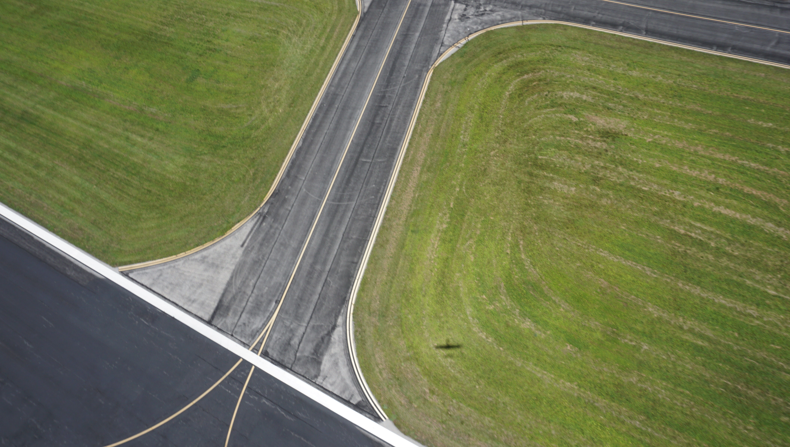
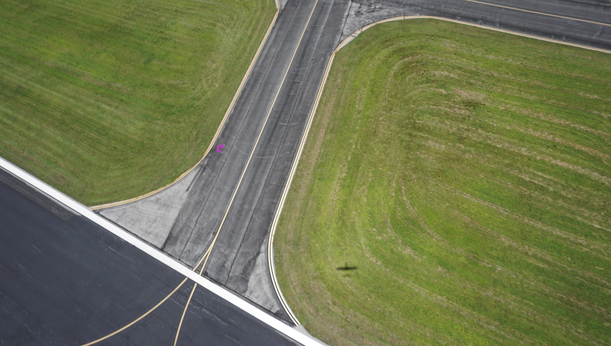

# Basic Image Manipulation

## Geometric Transformations  
PIL has predefined functions for the many image transformations we use to create our training dataset.
Another image transformation package is OpenCV which can do everything PIL does and more; however, we will stick with PIL because it is a smaller package.

In the following example we will walk through how we create our training data for our vision models. We will augment our artifical targets to and then paste them onto background images to make the data.

```python
from PIL import Image
img = Image.open("//path//to//comp_photo.jpg")
# Sanity Check
img.show('Example Image')
```



Now, we need to load in our artifical targets.
Enter this into your browser to download our fake targets or click [here](
https://bintray.com/uavaustin/target-finder-assets/download_file?file_path=base-shapes-v1.tar.gz).


https://bintray.com/uavaustin/target-finder-assets/download_file?file_path=base-shapes-v1.tar.gz


Let's open one of the target images.

```python
shape = Image.open("//path//to//shape.jpg")
# Sanity Check #2
shape.show('Example shape')
```


Since we have the background and shape images loaded, let's do some augmentation to the shape and then paste it onto the background image.
Let's start with rotation. PIL's rotation function will return a copy of this image, rotated the given number of degrees counter clockwise around its centre. The function takes three arguments: 

 - angle --  the degrees to rotate clockwise about the center

 - resample --  optional flag to choose which technique to use to interpolate new pixel values expand.

 - expand -- If 1, the image will expand to fit the newly rotated image.

```python
img = img.rotate(45)
img.show('Rotated Image')
```


Now we need to paste on an alphanumeric to make this a complete target.

```python
# Create an object which we can edit
target_draw = ImageDraw.Draw(target)

# Use B for example
alpha = 'B'

# Define font multiplier to shrink or grow to fit letter to target
font_multiplier = 0.5

# Path to font image file
font_file = './fonts/Gudea/Gudea-Bold.ttf'

# Create font height based on target size and scaled by font_multiplier
font_size = int(round(font_multiplier * target.height))

# Create font to put on target_draw
font = ImageFont.truetype(font_file, font_size)

# Get width and height of the font 
w, h = target_draw.textsize(alpha, font=font)

# Get top left coordinate of where to paste alpha onto target
x = (target.width - w) / 2
y = (target.height - h) / 2

# Set the rgb color of the alpha
alpha_rgb = ((64, 115, 64))

# Finally, draw the alpha onto the target
target_draw.text((x,y), alpha, alpha_rgb, font=font)

# Rotate target 
angle = 45
rotated_image = target.rotate(angle, expand=1)2
rotated_image.show("Rotated Image")

```


There is a white background around the target that we want to make transparent to we can paste just the target onto the background image. The code below will remove all white and replace with transparent values.

```python 
for x in range(rotated_image.width):
    for y in range(rotated_image.height):

        r, g, b, a = rotated_image.getpixel((x, y))

        if r == 255 and g == 255 and b == 255:
            rotated_image.putpixel((x, y), (0, 0, 0, 0))
```

PIL's getbbox funcition finds the smallest bounding box around the non zero region of the image as a 4-tuple. We can then use this 4-tuple to crop the image down to just the target. 

```python
rotated_crop = rotated_image.crop(rotated_image.getbbox()) 
```


Let's check the size of the target.
```python
rotated_image.size
>> (535, 535)
```
We need to downscale the target to make it more realistic on the background image.
```python 
rotated_image = rotated_image.resize(60,60)
```
Finally, time to paste the target onto the background. We will paste the target's top left pixel to (1500, 1000) on the background.
```python
background.paste(rotated_image, (1500, 1000),rotated_image)
background.show()
```



