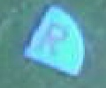
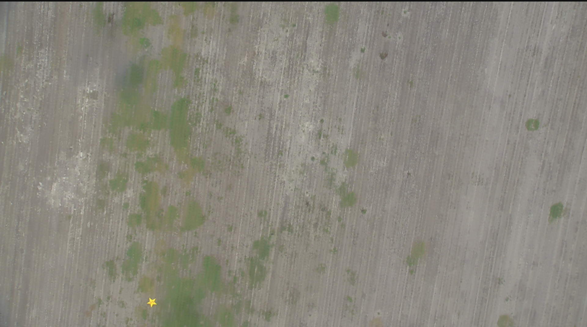

# Edge Detection

In the last section, we used PIL to crop, rotate, and expand an image to isolate the shape from the image of the field.
But how do we automate this process? 
Let's check out some useful functions in OpenCV.
Since OpenCV requires images to be in a numpy.ndarray, we will either need to open the image with cv2, or convert it from a PIL image.  

```python
import cv2
# Opening an image using cv2
img = cv2.imread("//path//to//comp_photo.jpg")
```  
```python
from PIL import Image
import cv2
import numpy as np
img = Image.open("//path//to//comp_photo.jpg")
# Converting an image from PIL to a numpy.ndarray
np.array(img)
cv2.imshow("CV2 Image", img)
cv2.waitKey(0)
```

If you've chosen to convert from a PIL image, you'll notice that your image has turned blue.
This is because CV2 defaults to a BGR color code.
You'll need to run the CV2 convert color function to fix this.  



```python
img = cv2.cvtColor(img, cv2.COLOR_RGB2BGR)
cv2.imshow("Color Corrected", img)
cv2.waitKey(0)
```

You should now have a numpy.ndarray that you can manipulate with OpenCV.
We use the Canny edge detection algorithm to pick up significant regions in an image.
Fortunately, OpenCV has a built in Canny() function that will run this algorithm for us.
For this next step, make sure you're working with the full competition image and not the one we just cropped.  

```python
edges = cv2.Canny(img, 200, 500)
# Note: This image will be very large if you decide to show this with cv2.imshow
cv2.imshow("Edges", edges)
cv2.waitKey(0)
```


The two values to the right are the thresholds for identifying an edge.
For our purposes, we will keep the thresholds at 200 and 500, but take a second to play around with different thresholds on your own to see how it changes your image.  

## Basic Contour Operations

We've figured out how to draw edges on an image, but how do we get information about the contours?
Before we do anything, we will need to convert our black and white edge image into a list of contours.  

```python
# Finds the threshold for detecting contours
_, thresh = cv2.threshold(edges, 127, 255, 0)
# Actually finds the contours
image, contours, _ = cv2.findContours(thresh, cv2.RETR_EXTERNAL, cv2.CHAIN_APPROX_SIMPLE)
```

We can now cycle through all the contours in an image and find out information about them.
Here are some of the most commonly contour operations:  

```python
for cnt in contours:
    area = cv2.contourArea(cnt)
	perimeter = cvt.arcLength(cnt, True)
	# Smooths out bumpy contours
	epsilon = 0.1*cv2.arcLength(cnt,True)
	approx = cv2.approcPolyDP(cnt, epsilon, True)
	# Draws a bounding box around the contour - useful for cropping
	x, y, w, h = cv2.boundingRect(np.asarray(cnt))
```

### Exercise:
Use what we've learned in this section to crop our edge image to look like this:  


_Note: The syntax to crop an image using CV2 is img = img[y:y+h,x:x+h]_

<details><summary>Solution</summary>
<p>

```python
_, thresh = cv2.threshold(edges, 127, 255, 0)
image, contours, _ = cv2.findContours(thresh, cv2.RETR_EXTERNAL, cv2.CHAIN_APPROX_SIMPLE)
for cnt in contours:
    x, y, w, h = cv2.boundingRect(np.asarray(cnt))
	edges = edges[y:y+h, x:x+w]
	cv2.imshow("Edges", edges)
	cv2.waitKey(0)
```

</p>
</details>

The image we've been using returns a nice, closed contour that we can send in for classification.
Let's consider the case of an image that returns a contour that is not completely closed.  




In this photo you can see that two of the points on this star aren't fully closed.
This is bad for two reasons:
It will leave us unable to apply a black background to the image for color classification, and it will send two partial contours for classification rather than one full one.
So how do we fix this?
Let's start by increasing the width of the edges to try and make these pieces connect.  

```python
# This creates a kernel of ones that will expand our contour out 3 pixels.
kernel = np.ones((3, 3), np.uint8)
edges = cv2.dilate(edges, kernel, 1)
```


Now our edges are connecting!
The edges are a bit thicker than we would like though, so let's erode our star back to its original state.  

```python
edges = cv2.erode(edges, kernel, 1)
```


We now have two fully closed, cropped contours that are ready to be taken through the final step of preprocessing.  