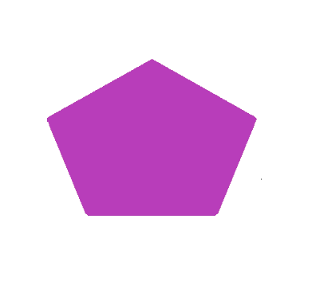

# Basic Image Manipulation and Data Generation

Over the next couple of examples, we will walk through how we create training data for
our vision models. Roughly, we will take pre-drawn shapes, combine them with pre-defined
text, and paste the final target onto background tiles.

## Background Preparation

First, make sure PIL is installed:
```sh
python3 -m pip install pillow==7.2.0
```

Now, let's get coding.
```python
# Import the PIL package.
from PIL import Image

# Open up the background image. NOTE: The path on your computer will be different.
img = Image.open("//path//to//comp_photo.jpg")

# Sanity check to make sure you have the right image.
img.show("Example Image")
```


Also, check the size of this image. Machine learning models are more performant on
smaller images because there is less computation. Therfore, we need to be mindful about
our input image size.
```python
print(f"Image width, height: {*img.size,}.")
```

We'll need to take tiles from this image to make the input more manageable for the model.
Let's make some 512 x 512 pixel tiles. This is the size we currently use for our object
detection model.

```python
# Desired tile size.
tile_width = tile_height = 512

# Make a folder to save images. We use `pathlib` for most path manipulation.
import pathlib

save_dir = pathlib.Path("//path/to/output/folder").expanduser()
save_dir.mkdir(exist_ok=True, parents=True)

# Now tile up the image:
for x in range(0, img.size[0] - tile_width, tile_width):
    for y in range(0, img.size[1] - tile_height, tile_height):
        crop = img.crop((x, y, x + tile_width, y + tile_height))
        crop.save(save_dir / f"crop_{x}_{y}.jpg")

print(f"Generated {len(list(save_dir.glob('*.jpg')))} slices!")
```

You should see tiles in your `save_dir` folder!

## Target Generation Setup

Now, we need to load in our artifical targets. We'll use python's
[`tarfile`](https://docs.python.org/3/library/tarfile.html) package to extract the shapes. First,
install the python module `requests==2.24.0` using `pip`.

```python
import tarfile
import tempfile
import requests

# Where to download assets.
url = "https://bintray.com/uavaustin/target-finder-assets/download_file?file_path=base-shapes-v1.tar.gz"

# Where to save assets.
save_dir = pathlib.Path("//path/to/save/dir").expanduser()
save_dir.mkdir(exist_ok=True, parents=True)

res = requests.get(url, stream=True)

# Make a temp dir to download archive.
with tempfile.TemporaryDirectory() as d:
    tmp_file = pathlib.Path(d) / "file.tar.gz"
    tmp_file.write_bytes(res.raw.read())

    with tarfile.open(tmp_file) as tar:
        tar.extractall(save_dir)
```
Congrats! You now have the shapes for data generation. Let's open one of the target images.

```python
shape = Image.open("//path//to//shape.jpg")

# Sanity check
shape.show("Example shape")
```


Finally, we need to download the various fonts we currently use for data generation. Perform
the same steps you did to download the shapes, but use this url instead:
`https://bintray.com/uavaustin/target-finder-assets/download_file?file_path=fonts.tar.gz`

## Image Manipulation

Since we have the background tiles and shape images loaded, let's do some augmentation to the shape and then paste it onto the background image.

Let's start with rotation. PIL's rotation function will return a copy of this image, rotated the given number of degrees counter clockwise around its center. The function takes three arguments: 

 - angle: the degrees to rotate counter clockwise about the center.

 - resample: optional flag to choose which technique to use to interpolate new pixel values expand.

 - expand: If 1, the image will expand to fit the newly rotated image.

```python
# First, you must open the target image!
target = target.rotate(45)
target.show('Rotated Image')
```


The next part of the data generation process requires pasting a letter onto the shape. Not only
must we identify the shape at competition, but also the letter or number!

```python
from PIL import ImageDraw, ImageFont

# Create an drawable object which we can edit.
target_draw = ImageDraw.Draw(target)

# Use B for example
alpha = "B"

# Define font multiplier to shrink or grow to fit letter to target. For some shape/letter
# combinations, we must adapt the size of the letter.
font_multiplier = 0.5

# Path to font image file
font_file = save_dir / "fonts/Gudea/Gudea-Bold.ttf"

# Create font height based on target size and scaled by font_multiplier.
font_size = int(round(font_multiplier * target.height))

# Create font to put on target_draw.
font = ImageFont.truetype(str(font_file), font_size)

# Get width and height of the font.
w, h = target_draw.textsize(alpha, font=font)

# Get top left coordinate of where to paste alpha onto target.
x = (target.width - w) / 2
y = (target.height - h) / 2

# Set the rgb color of the alpha.
alpha_rgb = ((64, 115, 64))  # Greenish

# Finally, draw the alpha onto the target
target_draw.text((x,y), alpha, alpha_rgb, font=font)

# Rotate target 
angle = 45
rotated_image = target.rotate(angle, expand=1)
rotated_image.show("Rotated Image")
```


Right now, there is a white background around the target, but we want to paste just the
target onto a background slice. How can we make everything but the target _transparent_?
Luckily, we can mainpulate the alpha channel on an image. This controls the pixel
transparency value. We will set all white pixels to 0 alpha.

```python 
for x in range(rotated_image.width):
    for y in range(rotated_image.height):

        r, g, b, a = rotated_image.getpixel((x, y))

        if r == 255 and g == 255 and b == 255:
            rotated_image.putpixel((x, y), (0, 0, 0, 0))
```

Using PIL's `getbbox` function, the smallest bounding box around the non zero region of
the image can expressed as a tuple. We can then use this tuple to crop the image down to
just the target. 

```python
rotated_crop = rotated_image.crop(rotated_image.getbbox()) 
```


We're getting close! Let's check the size of the target.
```python
rotated_image.size
>>> (535, 535)
```
We need to downscale the target to make it more realistic on the background slice.
Remember, the background tiles slices are only 512 x 512, so let's make the shape much
smaller.

```python 
rotated_image = rotated_image.resize((100, 100))
```

Finally, time to paste the target onto the background. We will paste the target's top
left pixel to (20, 20) on the background. But first, open up one of the background tiles
you created!
```python
paste_loc = (20, 20)
background_tile.paste(rotated_image, paste_loc, rotated_image)
background_tile.show()
```


We need to save the class and location of this target for our model data generation
later. We will save the target class, the (x,y) coordinate of the top left corner,
height, and width. 

```python
w_target, h_target = rotated_image.size
txt = pathlib.Path("background_target.txt")
txt.write_text(
    f"pentagon, {int(paste_loc[0])}, {int(paste_loc[1])}, {w_target}, {h_target}\n"
)
```
The output `background_target.txt` file should have the single following line:

`pentagon, 20, 20, 100, 100`

You've now gone through the basic pipeline of how we create our data for the models. Data
is by far the most important aspect of machine learning.