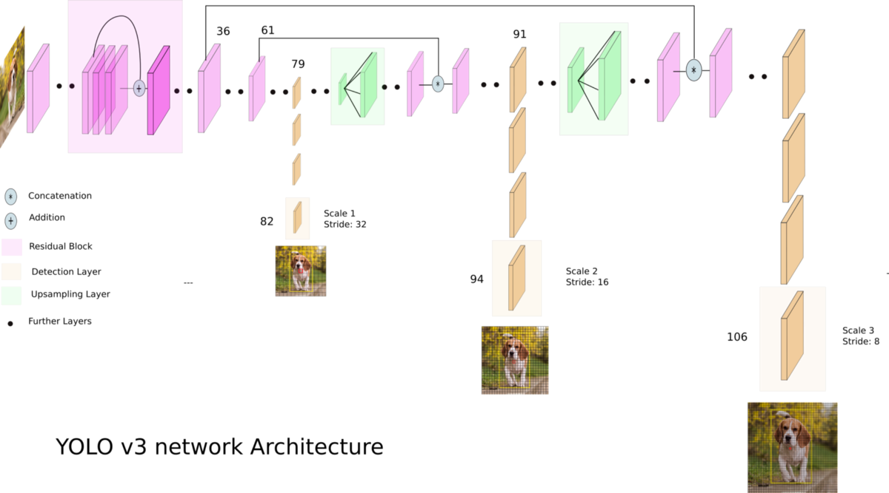
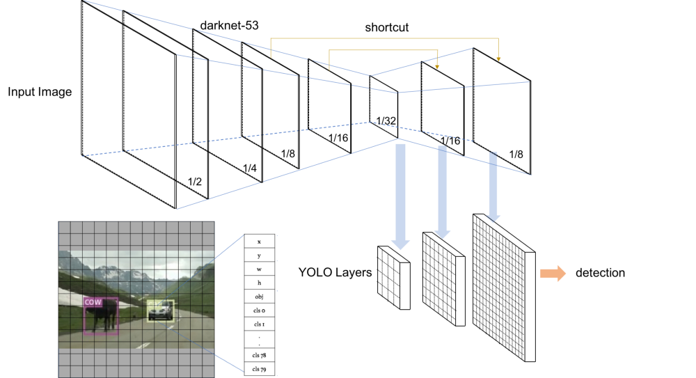

# YOLO Object Detector

Image classification mearly returns a class per image, but what if we want to localize where a certain target is within an image? This is where object detection comes in. 

There are a handful of object detection model types such as: Fast-RCNN's, Faster-RCNN's, and SSD; however, we implement the YOLO algorithm because of its much quicker than most other options while maintaining a high accuracy. 



YOLO's speed advantage comes from passing the entire start image through feature extraction engine that is simply comprised of the exact layers we just introduced in the Convolutional Neural Networks section! After this feature extractor, then comes the yolo layers which we will going in depth with.

The following is a complete YOLOv3 model with two yolo layers:

```ini
[net]
# Testing
batch=1
subdivisions=1
# Training
# batch=64
# subdivisions=2
width=416
height=416
channels=3
momentum=0.9
decay=0.0005
angle=0
saturation = 1.5
exposure = 1.5
hue=.1

learning_rate=0.001
burn_in=1000
max_batches = 500200
policy=steps
steps=400000,450000
scales=.1,.1

[convolutional]
batch_normalize=1
filters=16
size=3
stride=1
pad=1
activation=leaky

[maxpool]
size=2
stride=2

    ...

[convolutional]
size=1
stride=1
pad=1
filters=255
activation=linear


[yolo]
mask = 3,4,5
anchors = 10,14,  23,27,  37,58,  81,82,  135,169,  344,319
classes=80
num=6
jitter=.3
ignore_thresh = .7
truth_thresh = 1
random=1

[route]
layers = -4

[convolutional]
batch_normalize=1
filters=128
size=1
stride=1
pad=1
activation=leaky

[upsample]
stride=2

[route]
layers = -1, 8

[convolutional]
batch_normalize=1
filters=256
size=3
stride=1
pad=1
activation=leaky

[convolutional]
size=1
stride=1
pad=1
filters=255
activation=linear

[yolo]
mask = 0,1,2
anchors = 10,14,  23,27,  37,58,  81,82,  135,169,  344,319
classes=80
num=6
jitter=.3
ignore_thresh = .7
truth_thresh = 1
random=1
```

First, let's go over the sections before the first `[convolutional]` layer.

 - `batch`: number of images to send in to the gpu. GPU with larger memmory means it can train on more images at a time.
 - `subdivisions`: number chunks to split the batch size up in to
 - `width`: input size of image. Image will be resized to this dimension upon input if not already this size.
 - `height`: input size of image. Image will be resized to this dimension upon input if not already this size.
 - `channels`: number of input layers. It's 3 here because our input image is RGB.
 - `momentum, decay`: These two parameters apply to the gradient descent algorithm.

 Angle, saturation, exposure, and hue are all data augmentation parameters that are randomly applied to data during training to increase the robustness of the model.

 The next group of paramters all deal with the gradient descent algorithm and are out of the scope of this training documentation. 

 Next, you can see the `[convolutional]` blocks are the exact same as what we covered in the Convolutional Neural Networks section! After many convolutional layers, we reach the `[yolo]` layers. 

 The `mask` paramter (poorly named) tells the model which anchor boxes to use to predict targets. For exammple, we have 6 anchors, and in the first `[yolo]` layer, `mask = 3,4,5` because we want the model to use the last three of our boxes to make predictions. We want the first layer to predict the largest boxes because the input is at its coarsest scale right now i.e. the original input has been downsampled. 




When we real the yolo layer, the image is divided into a grid of squares and in each square there are a `num` of rectanglular `anchors` boxes. The models job is to predict which box or boxes associate with a target in that square. This prediction happens three times. The first time, the input layer is 1/32 the size of the original image, the second yolo layer acts on a input layer 1/6 the original, and lastly a prediction on layer 1/8 the original image. 

You might notice the image is increasing by a factor of 2, which comes from the stride of the `[unsample]` layers. The unsampling method is used to increase the size of the previous layer. This helps small object prediction which is of great interest to us. 

The `[route]` layers are used to bring back previous layers to help guide the unsampling process. This can also be referred to _residual_. For example, `layers =  -1,8` means to combine the output of the previous layer and eighth layer of the model.

`jitter` is another data augmentation that randomly changes the aspect ratio and size of images to make the model more robust. 

We can ignore `ignore_thresh` and `truth_thresh` as they are not used and are mearly artifacts of experimentation from the source code. 

