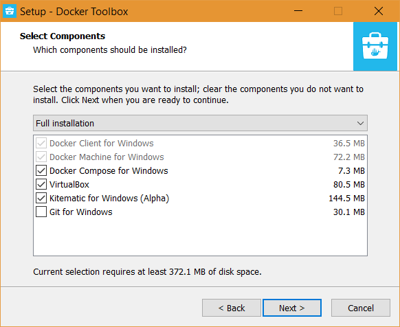
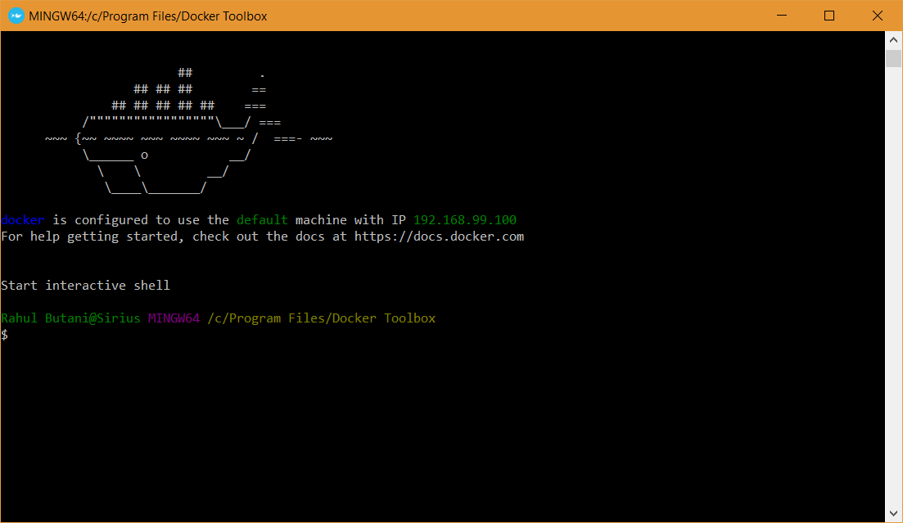
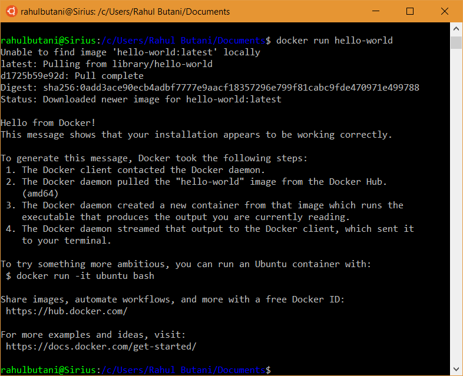

# Windows

> Note: All of these steps assume you have already [installed and configured WSL](../getting-started/windows.md).

Setting up Docker on Windows is a little bit complicated because of the WSL so bear with us. There are a few things we need to get out of the way first:
 - The variant of Docker that will run best on your computer depends on what edition of Windows you're running. If you're running an edition of Windows 10 with Hyper-V support (Education, Enterprise, or Professional) *and* if your computer supports SLAT + VT-x/AMD-V *and* if such features are enabled in your computer's UEFI, then you can install [Docker for Windows](https://docs.docker.com/v17.09/docker-for-windows/install/).
 - However, if any of the above are not true, you must run [Docker Toolbox](https://docs.docker.com/toolbox/toolbox_install_windows/).
 - The difference is that Docker for Windows makes good use of the Virtualization APIs provided by modern OSes and hardware while Docker Toolbox (intentionally) does not. Instead it runs a virtual machine (boot2docker) on top of which docker runs.
 - Docker for Windows is the better option if you computer is capable of running it. However, for simplicity (and our collective sanity) we *won't* be providing instructions on setting up WSL with Docker for Windows. You are free to attempt such a setup yourself; [this](https://nickjanetakis.com/blog/setting-up-docker-for-windows-and-wsl-to-work-flawlessly) is probably a helpful resource and is roughly what this guide is based on.
     + It's also worth noting that some have reported some woes when using VirtualBox with Hyper-V.

If none of the above made any sense to you, do not worry. Installing Docker Toolbox will work just fine.

With that out of the way we can begin.

## Installing Docker Toolbox on Windows

First, download [this](https://download.docker.com/win/stable/DockerToolbox.exe) installer for Docker Toolbox (Community Edition). The link points to the latest stable version of Docker Toolbox which, as of this writing, is v18.03.0.

Launch the installer and run through the steps:


Pick the 'Full Installation' option:



Once the installer finishes, launch the "Docker Quickstart Terminal":


It should proceed to download and configure a boot2docker image and a VBox VM. Eventually, you should arrive at something that looks like this:



## Installing the Docker Client on WSL

Now that we've installed Docker on Windows, we're going to set up things on the WSL side so that we can use Docker from within WSL.

The first thing we need to do is install the Docker client.

> Note: This assumes you choose to install the Ubuntu 18.04 LTS Distribution from the Windows Store. If not, adjust your commands accordingly; [this](https://docs.docker.com/install/#supported-platforms) is a good resource.

Open your terminal and run:

```shell
$ sudo apt update
$ sudo apt install apt-transport-https \
    ca-certificates \
    curl \
    software-properties-common
$ curl -fsSL https://download.docker.com/linux/ubuntu/gpg | sudo apt-key add -
$ sudo add-apt-repository \
   "deb [arch=amd64] https://download.docker.com/linux/ubuntu \
   $(lsb_release -cs) \
   stable"
```

This tells `apt` how and from where to install the Docker client. Now lets actually install it:

```shell
$ sudo apt update
$ sudo apt install docker-ce
```

Once that finishes, let's check to make sure that docker is actually installed:

```shell
$ docker --version
```

You should see the latest Docker version printed out (v18.06.1 as of this writing).

Next, we need to add a usergroup for Docker and add ourselves to said group so that we don't need to run every `docker` command with `sudo`:

```shell
$ sudo groupadd docker
$ sudo usermod -aG docker $(whoami)
```

For the changes to take, we need to restart the terminal (close all terminal windows and then reopen them).

Let's check that the we're actually part of the group:

```shell
$ groups
```

If everything went right, docker should be listed in the output.

## Synthesis

At this point we have Docker installed and (hopefully) working on Windows and the Docker Client installed within WSL. Now it's time to make them talk to each other. To do that we'll need to run one very magical command:

```shell
$ cat <<EOF >> ~/.bashrc

# Docker Client <--> Docker Toolbox
eval \$(docker-machine.exe env --shell=bash --no-proxy default)
export DOCKER_CERT_PATH=\$(dos2wslPath "\${DOCKER_CERT_PATH}")
EOF
```

Let's test it:

```shell
$ source ~/.bashrc
$ docker info
```

If everything went according to plan, you should now be looking at a shiny message about the docker daemon.

Just to be sure things actually work, let's try to run a really simple Docker image:

```shell
$ docker run hello-world
```

You should see something like this:



## Docker Compose

Finally, the very last thing we need to do to have a fully functional Docker setup is to install Docker Compose. As of this writing, the [latest version of Docker Compose](https://github.com/docker/compose/releases) is v1.22.0.

To install:

```shell
$ sudo curl -L "https://github.com/docker/compose/releases/download/1.22.0/docker-compose-$(uname -s)-$(uname -m)" -o /usr/local/bin/docker-compose
$ sudo chmod +x /usr/local/bin/docker-compose
$ sudo curl -L https://raw.githubusercontent.com/docker/compose/1.22.0/contrib/completion/bash/docker-compose -o /etc/bash_completion.d/docker-compose
```

Once that finishes, to check that everything is a-okay, run:

```shell
$ docker-compose --version
```

If you get "docker-compose version 1.22.0" or something to that effect, you're good to go. 🐋
