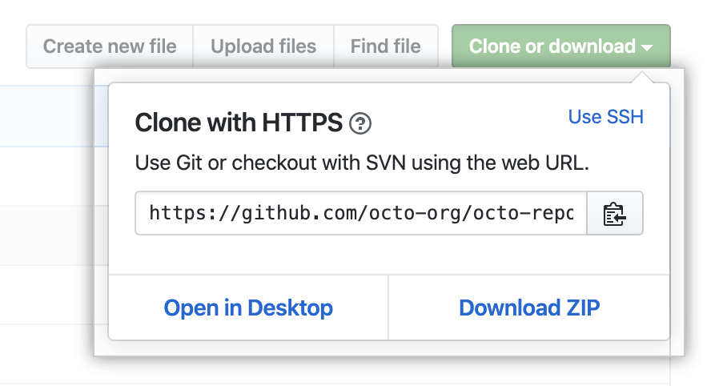
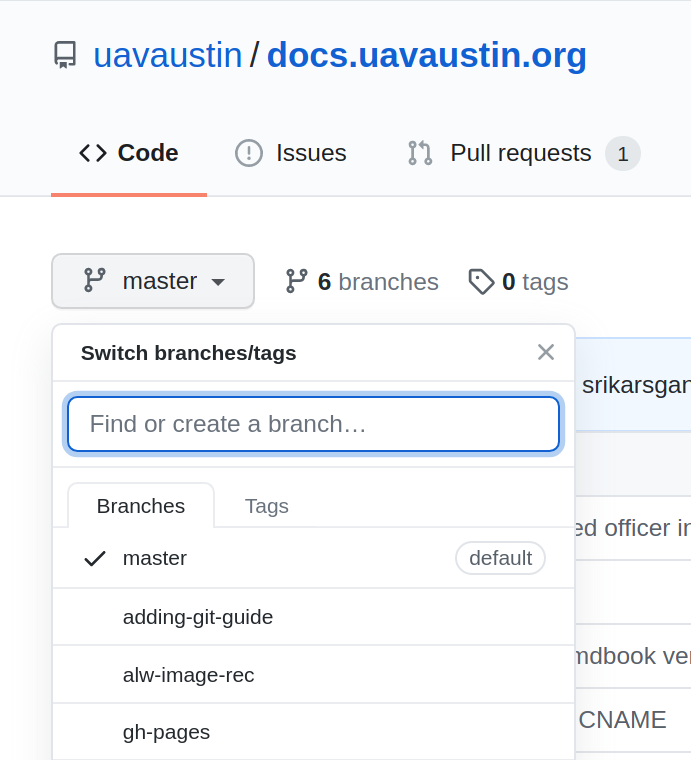
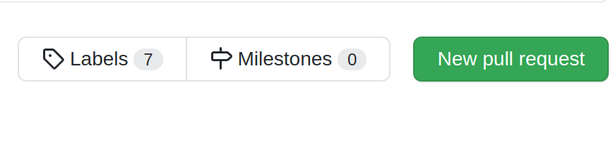

# Using Git with GitHub
GitHub is a cloud-based Git repository hosting service we use to host all 
of our software.

Create a GitHub account if you haven't already and join the UAV Austin organization. 
If you have a GitHub account and are interested in upgrading to GitHub Pro for free,
join the [GitHub Student Developer Program](https://education.github.com/pack).

Our repositories can be found [here](https://github.com/uavaustin).

## Contributing to a Repository
**Starting a Local Repository**

Go to the repository link of the project that you want to work on or create your own.

Copy the remote URL onto your clipboard:



On your local machine and in the desired directory:
```
$ git clone <remote-url>
```
If you are making your own repository:
```
$ git init
$ git remote add origin <remote-url>
```
**Updating a Local Repository**

Sometimes there will be updates to master in the remote repository; to merge/inspect
these changes, consider the following commands.
```
$ git fetch origin
```
`git fetch` will download data from the remote repository, but will not 
modify anything locally. This is a good way to check up on the progress
of other collaborators.
```
$ git pull origin master
```
`git pull` runs the aforementioned `fetch` and then merges the changes in
the remote repository to your local environment. Pull is equivalent to a 
`fetch` and then a `merge`. As such, there is a chance for merge conflicts
if you share modified files or lines with the remote repository.

**Updating a Remote Repository**

When working on a feature, it's a good idea to create your own branch instead
of working directly on master. To update the remote repository to show your
new branch:
```
$ git push -u origin <branch-name> # -u flag needed if branch not present on remote
```
You can see if the push was successful by checking your pushed branch on GitHub
by clicking on the branch drop-down underneath "Code":



## An Example
We'll do an example of all this real fast.

*Note that this example is using the command-line Git client, however you may
also do this with something like
[GitHub&nbsp;Desktop](http://desktop.github.com) if you wish.*

### Creating Feature Branches

Say you have a task telling you to add a stock photo of a cat to a GUI. In this
case, we'll add a Scottish Fold since they're by far one of the cutest cats
there are.


We're going to want to make a new branch off of *master* to work on, so we
don't bother someone else working on the same project.

Feature branch naming schemes will ultimately depend on the team, but for
now we will simply offer a brief description of our feature in lowercase
and separate words by hyphens.

We'll name our branch *add-cat-picture*.

The very first step we'll need to do is to get all the new changes from the
remote repository.

```
$ git pull
```

If this step is forgotten it's possible that this branch may be missing
important changes already committed. Even worse, this could cause a merge
conflict down the road.

There are two ways we can make the branch here. The straightforward way is
to make it using `git branch`. (Make sure you're in the *master* branch before
continuing!)

```
$ git branch add-cat-picture
```

This, however, only creates the branch, it does not switch our working
directory to this branch. To do that we'll use `git checkout`.

```
$ git checkout add-cat-picture
```

The second way to make the branch is to do both the branch creation and the
switching in one step.

```
$ git checkout -b add-cat-picture
```

The `-b` flag is what creates the new branch on checkout.

### Start Working in our Branch

Now although we've made our new branch, it currently is only on our own
machines and has nothing in it. We'll add something here so this branch has
meaning and then we'll push this new branch to our remote repository on GitHub.

So in this case, let's say we're editing the file `index.html`. This is where
we're adding our cat picture.

After we make our change, we'll need to get it committed to our local
repository and then to the remote repository.

Commit messages should be short and descriptive. It's also better to make
smaller, frequent commits (that are related!) than larger, fewer ones.

A good rule of thumb is that if you can't summarize your changes in a fairly
short sentence, you should break stuff into separate commits.

So we'll assume we added our cat picture to `index.html`.

Getting this file to the remote repository is going to require 3 steps:
`git add`, `git commit`, and `git push`.

Let's go ahead and run `git add` to schedule our change to be committed.

```
$ git add index.html
```

Now our new file is ready to be committed!

```
$ git commit -m "Adding the cat picture to index.html"
```

The `-m "<message>"` part sets our commit message. This allows others to know
what changes were made on this commit. Quotations are important here.

Lastly, we'll need to add our *add-cat-picture* branch to the remote
repository.

```
$ git push -u origin add-cat-picture
```

It should now be published on GitHub!

So at this point, we have our feature branch *add-cat-picture* and it is
currently viewable on GitHub as well. To see different branches on GitHub is
fairly simple.

In the GitHub UI you can simple switch branches with the dropbox or by clicking
"x branches" at the top. When on the correct branch, clicking on "x commits"
will show all the changes made as well.

### Continuing our Work

Alright so we can still continue working in our branch. In this example we'll
make two more commits.

The cat picture deserves a little fun caption below it, because why not? So
we'd go ahead and make this change and decide to commit it.

Though right afterwards, we realized that the caption should be in a better
font and so we changed it afterwards.

After these two commits, we'll then push to the remote repository again so
others can see our cool changes.

So this should feel fairly familiar. We'll add our caption and then run both
`git add` and `git commit`.

```
$ git add index.html
$ git commit -m "Added a caption under the cat picture"
```

Now we'll make our second change (that we figured we wanted after our first
commit). We'll do this the same way again.

```
$ git add index.html
$ git commit -m "Made the caption actually look nice"
```

At this point, these commits are only on our own machine and no one else can
see these.

```
$ git push origin add-cat-picture
```

Now this is on the remote repository. Note that we don't need the `-u` flag as
that was just for the first push.

### Making a Pull Request

Alrighty, so we've gotten to the point where we think our changes are nearly
done, and we're ready to merge this in with the rest of the repository. Now
everyone can enjoy our cute cat picture with the caption.

Now we'll make a *pull request*.

So there are things out there that'll allow you to create a pull request
though the command-line, but we're not going to do that.

To make the pull request, simply go to the main GitHub page for the repository
and click "New pull request".



The "base" should simply be *master*, and "compare" should be our
*add-cat-picture* branch.

Put a nice title and a short description as well, if needed, for the pull
request. There is also an option for a *draft pull request* which tells 
other people working on the project that the branch is still a work progress
and may need feedback before continuing.

Now luckily with changes like the ones we made, we shouldn't have any merge
conflicts.


