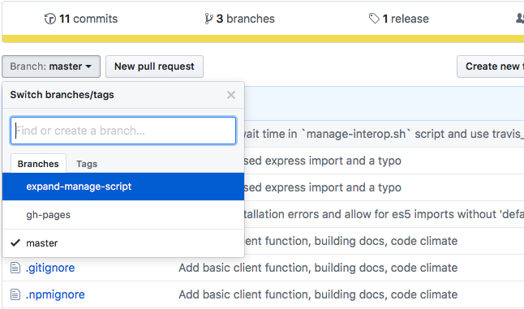

# Using Git and GitHub

## Branching

In order for us to all work together on the same project, we use Git branching
often. This allows us to all contribute at the same time without interference,
and for us to merge our work into the main line when it's done and has been
verified.

In most UAV Austin repositories, the main state of the code is in the *master*
branch. For each card on Trello, generally, we will have a *feature branch* for
it while it is in development. When it's just about finished, you'll add a
*pull request* (or *PR*) to merge it into the *master* branch. A team lead will
review the code real fast, make sure it's good, and then merge it in.

## Merging

*Directed towards team leads.*

Make sure to use the `--no-ff` flag when merging by the command line, this will
preserve the branch history on the graph.

## Exceptions to Branching

If you're just starting a repository, or are in very early states in
development on it, it may simply be appropriate to commit directly to master.

Flight View is also an exception to some of these rules, essentially we're
doing git-flow *lite* here.

- Feature branches should split off of the *develop* branch.
- Release branches should be made before pulling new features from the
*develop* branch to *master*.
- Hotfix branches are made for small bug fixes after a release.

See this link for how to do release and hotfix branches as well:
http://nvie.com/posts/a-successful-git-branching-model/

The Flight View *master* branch is for tagging releases only, it is intended to
be kept stable.

## Version Tagging

Only team leads should make version tags. I'll take care of doing the release
part of it. Releases are to be in the following formats:

- *v1.0*
- *v1.0-beta.1*
- *v1.0-rc.1*
- *v1.2.1*
- *v1.2.1-beta.1*
- *v1.2.1-rc.1*

Smaller code bases use the Major.Minor versioning numbers, and larger use
Major.Minor.Patch.

Team leads should only be making tags for non-dev versions, i.e. *v1.0* or
*v1.2.1*.

## An Example

We'll do an example of all this real fast.

*Note that this example is using the command-line Git client, however you may
also do this with something like
[GitHub&nbsp;Desktop](http://desktop.github.com) if you wish.*



### Creating Feature Branches

Say you have a task telling you to add a stock photo of a cat to a GUI. In this
case, we'll add a Scottish Fold since they're by far one of the cutest cats
there are.

<center>
    
</center>

We're going to want to make a new branch off of *master* to work on, so we
don't bother someone else working on the same project.

Feature branches should have a short, descriptive name. Our naming convention
for feature branches is to simply use lower-case names separated by hyphens.

For this, we'll name our branch *add-cat-picture*.



The very first step we'll need to do is to get all the new changes from the
remote repository.

```
$ git pull
```

If this step is forgotten it's possible that this branch may be missing
important changes already committed. Even worse, this could cause a merge
conflict down the road.

There are two ways we can make the branch here. The straight forward to way is
to make it using `git branch`. (Make sure you're in the *master* branch before
continuing!)

```
$ git branch add-cat-picture
```

This, however, only creates the branch, it does not switch our working
directory to this branch. To do that we'll use `git checkout`.

```
$ git checkout add-cat-picture
```

The second way to make the branch is to do both the branch creation and the
switching in one step.

```
$ git checkout -b add-cat-picture
```

The `-b` flag is what creates the new branch on checkout.





### Start Working in our Branch

Now although we've made our new branch, it currently is only on our own
machines and has nothing in it. We'll add something here so this branch has
meaning and then we'll get this new branch on GitHub.

So in this case, let's say we're editing the file `index.html`. This is where
we're adding our cat picture.

After we make our change, we'll need to get it committed to our local
repository and then to the remote repository.

Commit messages should be should and descriptive. It's also better to make
smaller, frequent commits then larger, fewer ones.

A good rule of thumb is that if you can't summarize your changes in a fairly
short sentence, you should break stuff into separate commits.



So we'll assume we added our cat picture to `index.html`.

Getting this file to the remote repository is going to require 3 steps:
`git add`, `git commit`, and `git push`.

Let's go ahead and run `git add` to schedule our change to be committed.

```
$ git add index.html
```

Now our new file is ready to be committed!

```
$ git commit -m "Adding the cat picture to index.html"
```

The `-m "<message>"` part sets our commit message. This allows others to know
what changes were made on this commit.

Lastly, we'll need to add our *add-cat-picture* branch to the remote
repository.

```
$ git push -u origin add-cat-picture
```

It should now be published on GitHub!



So at this point, we have our feature branch *add-cat-picture* and it is
currently viewable on GitHub as well. To see different branches on GitHub is
fairly simple.

In the GitHub UI you can simple switch branches with the dropbox or by clicking
"x branches" at the top. When on the correct branch, clicking on "x commits"
will show all the changes made as well.

<br>
<center>
    
</center>
<br>

*It doesn't say there's an add-cat-picture there at the moment but you can use
your imagination.*



### Continuing our Work

Alright so we can still continuing working in our branch. In this example we'll
make two more commits.

The cat picture deserves a little fun caption below it, because why not? So
we'd go ahead and make this change and decide to commit it.

Though right afterwards, we realized that the caption should be in a better
font and so we changed it afterwards.

After these two commits, we'll then push to the remote repository again so
others can see our cool changes.



So this should feel fairly familiar. We'll add our caption and then run both
`git add` and `git commit`.

```
$ git add index.html
$ git commit -m "Added a caption under the cat picture"
```

Now we'll make our second change (that we figured we wanted after our first
commit). We'll do this the same way again.

```
$ git add index.html
$ git commit -m "Made the caption actually look nice"
```

At this point, these commits are only on our own machine and no one else can
see these.

```
$ git push origin add-cat-picture
```

Now this is on the remote repository. Note that we don't need the `-u` flag as
that was just for the first push.





### Making a Pull Request

Alrighty, so we've gotten to the point where we think are changes are nearly
done, and we're readying to merge this in with the rest of the repository. Now
everyone can enjoy our cute cat picture with the caption.

This point is when we'll make a *pull request*.



So there are things out there that'll allow you to create a pull request
though the command-line, but we're not going to do that.

To make the pull request, simply go to the main GitHub page for the repository
and click "New pull request".

The "base" should simply be *master*, and "compare" should be our
*add-cat-picture* branch.

Put a nice title and a short description as well, if needed, for the pull
request.

Now luckily with changes like the ones we made, we shouldn't have any merge
conflicts.


